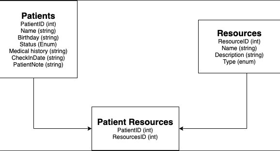

# 401 Mid-term Project 

## Project Hospitaller
---
### We are deployed on Azure!

[project url here]

---
## Web Application
***[Explain your app, should be at least a paragraph. What does it do? Why should I use? Sell your product!]***

The web application consists of a frontend written in Razor views, HTML, CSS,
Bootstrap, Popper, and jQuery. The backend was written in C# using ASP.NET Core 2, Entity Framework Core, and the MVC framework.

An interface is provided to create new blog
posts, view existing blog posts, edit existing blog posts, delete existing
blog posts, and search by both keywords and usernames. All blog posts can be
enriched using Azure Language Services (part of Microsoft's Cognitive Services
suite), Bing Image API, and Parallel Dots (for automated tagging of posts via
key phrases detected within the post's body). Image enrichments can be added
based on the overall sentiment score (a range 0.0 - 1.0 related to the mood
of the post) and key phrases / keywords detected in the posts. Optionally, users
can choose to opt-out of these features for privacy or data collection concerns.

---

## Tools Used
Microsoft Visual Studio Community 2017 (Version 15.5.7)

- C#
- ASP.Net Core
- Entity Framework
- MVC
- Azure

---

## Getting Started

Clone this repository to your local machine.

```
$ git clone https://github.com/Team-Forky/API.git
```
Once downloaded, you can either use the dotnet CLI utilities or Visual Studio 2017 (or greater) to build the web application. The solution file is located in the AmandaFE subdirectory at the root of the repository.
```
cd YourRepo/YourProject
dotnet build
```
The dotnet tools will automatically restore any NuGet dependencies. Before running the application, the provided code-first migration will need to be applied to the SQL server of your choice configured in the /AmandaFE/AmandaFE/appsettings.json file. This requires the Microsoft.EntityFrameworkCore.Tools NuGet package and can be run from the NuGet Package Manager Console:
```
Update-Database
```
Once the database has been created, the application can be run. Options for running and debugging the application using IIS Express or Kestrel are provided within Visual Studio. From the command line, the following will start an instance of the Kestrel server to host the application:
```
cd YourRepo/YourProject
dotnet run
```
Unit testing is included in the AmandaFE/FrontendTesting project using the xUnit test framework. Tests have been provided for models, view models, controllers, and utility classes for the application.

---

## Usage
***[Provide some images of your app with brief description as title]***

### Overview of Recent Posts


### Creating a Post


### Enriching a Post


### Viewing Post Details


---
## Data Flow (Frontend, Backend, REST API)
***[Add a clean and clear explanation of what the data flow is. Walk me through it.]***


---
## Data Model

### Overall Project Schema
***[Add a description of your DB schema. Explain the relationships to me.]***


---
## Model Properties and Requirements

### Patients

| Parameter | Type | Required |
| --- | --- | --- |
| ID  | int | YES |
| Name | string | YES |
| Birthday | string | YES |
| Status | enum | YES |
| CheckIn | string | YES |

### Resources

| Parameter | Type | Required |
| --- | --- | --- |
| ID  | int | YES |
| Name | string | YES |
| Description | string | YES |
| Type | enum | YES |

### PatientResources

| Parameter | Type | Required |
| --- | --- | --- |
| PatientID  | int | YES |
| ResourcesID | int | YES |

---

## Change Log
1.1: *Deploy database and backend* - 13 April 2020  

---

## Authors
Joseph Hangarter
Teddy Damian
---

For more information on Markdown: https://www.markdownguide.org/cheat-sheet
