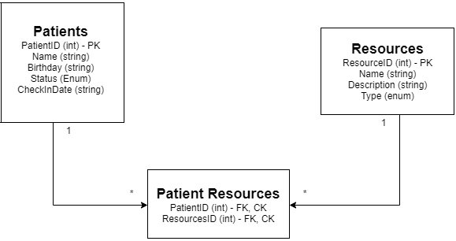

# 401 Mid-term Project 

## Project Hospitaller- Back end
---
### We are deployed on Azure!
* Swagger Documentation Back end API - https://hospitaller-api.azurewebsites.net/
* Front end - https://hospitallerfe-teamforky.azurewebsites.net

---
## Web Application

The API consists of 3 Tables that consists of Patients, Resources, & Patient Resources.
The backend was written in C# using ASP.NET Core, Entity Framework Core, and the MVC design pattern.

* With this API, a care-taker will be able to enter, retrieve, update, or remove a patient/resource from a database. 
* Care-taker will be able to enter a patients name, age, status, and check in date/time when created.
* Care-taker will be able to assign an available specific resource to a patient. 
---

## Tools Used
Microsoft Visual Studio Community 2019

- C#
- ASP.Net Core
- Entity Framework
- MVC
- Azure
- Swagger
- Microsoft SQL Server Management Studio
- Postman

---

## Getting Started

Clone this repository to your local machine.

```
$ git clone https://github.com/Team-Forky/API.git
```
Once downloaded, you can either use the dotnet CLI utilities or Visual Studio 2017 (or greater) to build the web application. The solution file is located in the AmandaFE subdirectory at the root of the repository.
```
cd YourRepo/YourProject
dotnet build
```
The dotnet tools will automatically restore any NuGet dependencies. Before running the application, the provided code-first migration will need to be applied to the SQL server of your choice configured in the /Team-Forky-API/Team-Forky-API/appsettings.json file. This requires the Microsoft.EntityFrameworkCore.Tools NuGet package and can be run from the NuGet Package Manager Console:
```
Update-Database
```
Once the database has been created, the application can be run. Options for running and debugging the application using IIS Express or Kestrel are provided within Visual Studio. From the command line, the following will start an instance of the Kestrel server to host the application:
```
cd YourRepo/YourProject
dotnet run
```
---

## Overview

### Viewing all patients
#### route/api/patients


### Viewing a patient with all resources
#### route/api/patient/patientID


### Viewing a patient with a specific resource
#### route/api/patients/patientID/resourceID


### Creating a patient
#### route/api/patient


### Updating a patient
#### route/api/patient/patientID


---
## Data Flow (Frontend, Backend, REST API)


---
## Data Model


---
## Model Properties and Requirements

### Patients

| Parameter | Type | Required |
| --- | --- | --- |
| ID  | int | YES |
| Name | string | YES |
| Birthday | string | YES |
| Status | int | YES |
| CheckIn | string | YES |

### Resources

| Parameter | Type | Required |
| --- | --- | --- |
| ID  | int | YES |
| Name | string | YES |
| Description | string | YES |
| Type | int | YES |

### PatientResources

| Parameter | Type | Required |
| --- | --- | --- |
| PatientID  | int | YES |
| ResourcesID | int | YES |

---

## Change Log
* 1.5: *Fixed bug where routes that took an id parameter could not map to the ID parameter due to capitalization* - August 16 2020
* 1.4: *Added opertational join table LINQ queries. Swagger documentation added when launching app.*  - 16 April 2020
* 1.3: *CRUD Methods added for Resources and Patient Resources* - 15 April 2020
* 1.2: *CRUD Methods added for Patient* - 14 April 2020 
* 1.1: *Deploy database and backend with dummy DTO data for Patient* - 13 April 2020  

---

## Authors
* Joseph Hangarter
* Teddy Damian
* Andrew Casper
---

For more information on Markdown: https://www.markdownguide.org/cheat-sheet
